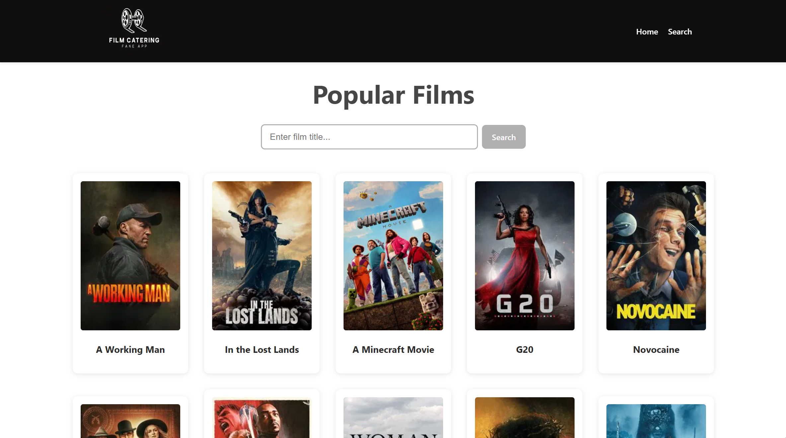
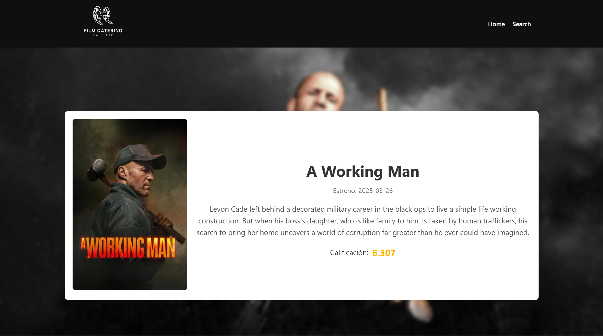
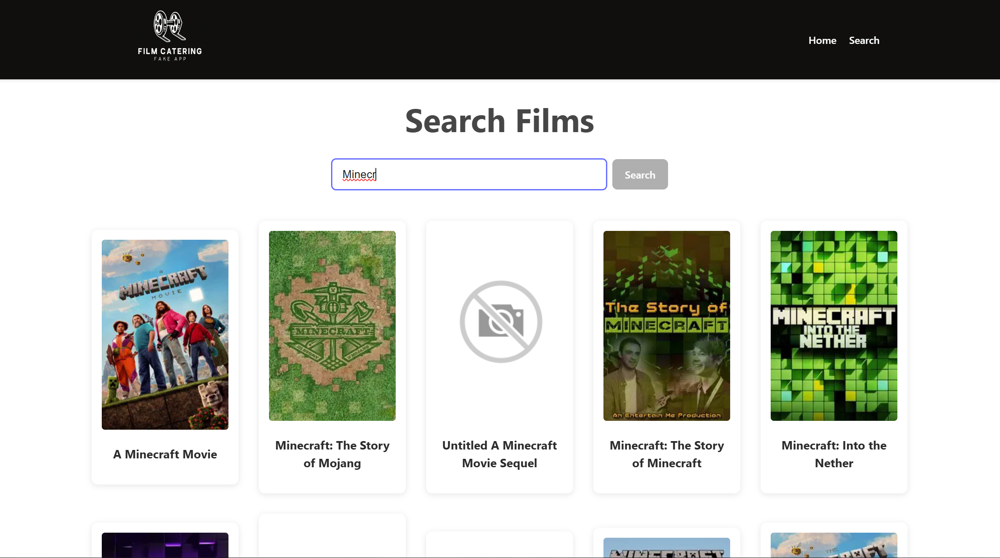

# Movie App SSR

Este proyecto es una aplicación web construida con React y Next.js, que permite a los usuarios explorar una lista de películas de manera interactiva y dinámica, utilizando renderizado del lado del servidor (SSR).

## Funcionalidades principales

- **Página de Inicio:** Muestra una lista de películas populares obtenidas desde The Movie Database API.
- **Detalle de Película:** Al hacer clic en una película, se muestra una página con su información detallada (título, fecha de estreno, descripción y calificación).
- **Búsqueda de Películas:** Una barra de búsqueda permite a los usuarios encontrar películas por su título.

## Capturas de pantalla de la aplicación





## Demostración

Puedes probar la aplicación desplegada en Vercel aquí:
[Movie App SSR](https://movie-app-ssr.vercel.app/)

## Instrucciones de Uso

1. Clona este repositorio:
   ```bash
   git clone https://github.com/DanielCaldes/movie-app-ssr.git
   cd movie-app-ssr
   ```
2. Instala las dependencias:
   ```bash
   npm install
   ```
3. Crea un archivo `.env.local` en la raíz del proyecto, basado en el archivo `.env.local.example`.
4. Agrega tu clave de API de The Movie Database (TMDB) en el archivo `.env.local`.
5. Inicia el entorno de desarrollo:
   ```bash
   npm run dev
   ```

## Estructura del proyecto
```bash
📁 public/
📁 src/
├── 📁 app/
│   ├── 📁 components/
│   │   ├── 📄 Footer.jsx         // Pie de página de la aplicación
│   │   ├── 📄 Header.jsx         // Encabezado con navegación hacia búsqueda y la página principal
│   │   ├── 📄 MovieCard.jsx      // Tarjeta de presentación de una película
│   │   ├── 📄 MovieList.jsx      // Componente para mostrar una lista de películas
│   │   └── 📄 SearchBar.jsx      // Barra de búsqueda para encontrar películas
│   ├── 📁 movie/
│   │   └── 📁 [id]/
│   │       └── 📄 page.js        // Página de detalles de una película específica
│   ├── 📁 search/
│   │   └── 📄 page.js            // Página de resultados de búsqueda
│   ├── 📄 globals.css            // Estilos globales de la aplicación
│   ├── 📄 layout.js              // Layout principal de la aplicación
│   └── 📄 page.js                // Página de inicio
📄 .env.local                     // Archivo de configuración local con API_KEY
📄 .env.local.example             // Archivo de ejemplo para configuración del entorno local
```
